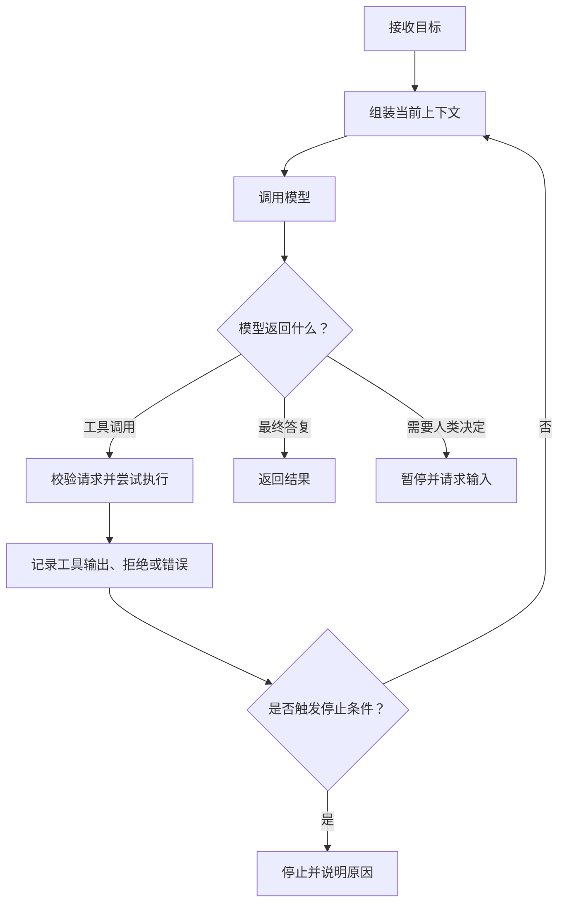
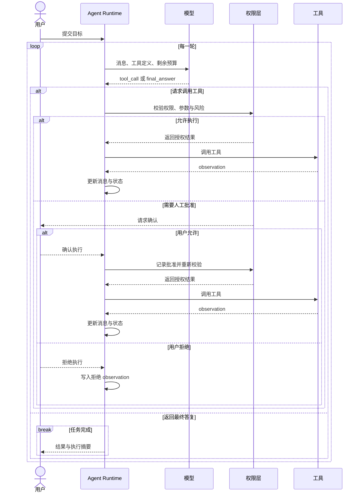
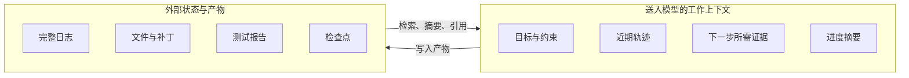
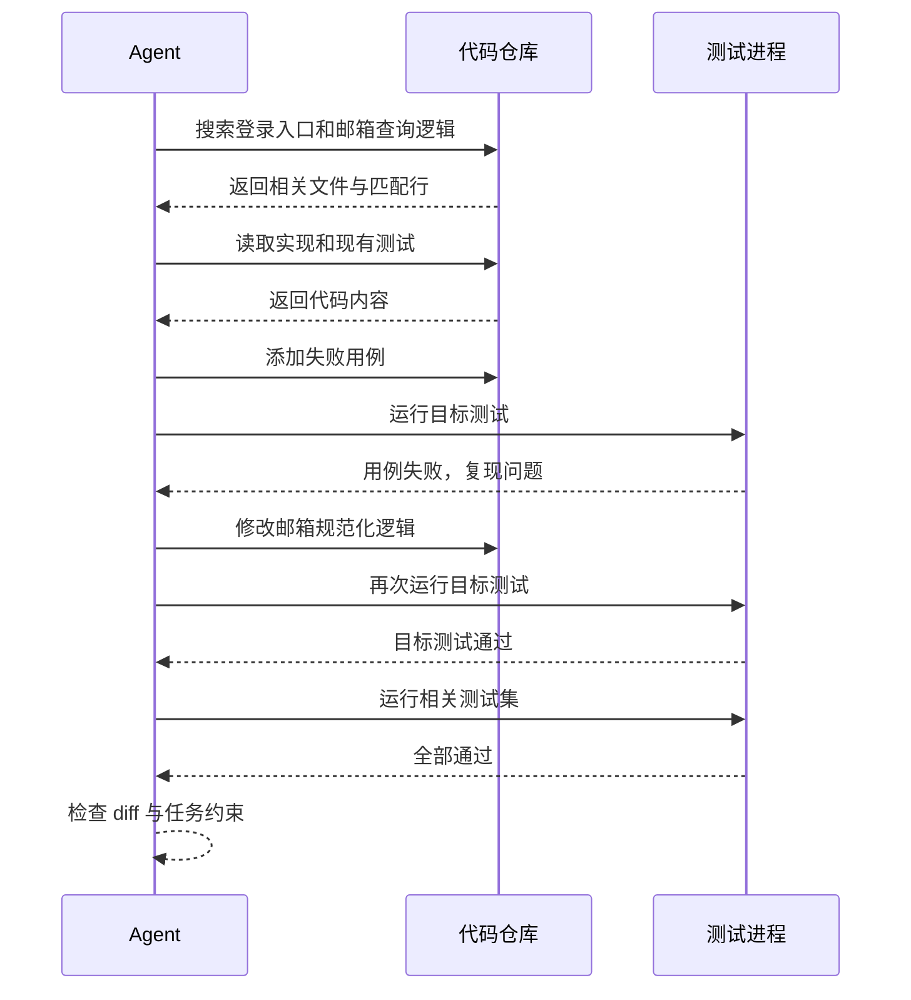

一次大模型调用接收输入、生成输出，然后结束。Agent 多了一层运行时：模型可以提出动作，程序执行动作，把结果送回模型，再让模型决定下一步。

这个反复进行的控制过程就是 Agent Loop。它没有神秘之处，难点也不在 `while` 循环本身。真正费工夫的是循环周围的东西：状态如何保存，工具能做什么，哪些动作需要批准，怎样判断任务已经完成，以及失控时如何停下来。



## 模型提出动作，运行时负责执行

很多 Agent 示例把模型调用和工具调用写在同一个函数里，看起来像是模型直接搜索网页、修改文件。实际边界要清楚得多：模型生成的是一份结构化请求，例如“调用 `read_file`，参数是某个路径”；真正访问文件系统的是模型外部的宿主程序。

一次循环通常有四步：

1. 运行时把目标、历史消息、可用工具和当前状态交给模型。
2. 模型返回最终答复，或者返回一个工具调用请求。
3. 运行时校验请求并执行工具，把输出包装成 observation。
4. observation 被追加到上下文，下一轮模型调用据此调整计划。

ReAct 工作把 reasoning、action 与来自环境的 observation 交错组织起来。在这个框架里，行动让模型接触外部事实，观察结果又会改变后续行动。[Google Research 对 ReAct 的介绍](https://research.google/blog/react-synergizing-reasoning-and-acting-in-language-models/)给出了这一过程的原始图示与实验背景。

下面的时序图更接近真实程序：



这一区分很重要。模型可能建议删除文件，但删除是否发生，取决于运行时的权限策略。安全边界必须放在模型之外。

## Loop 里到底保存什么

只保存聊天记录，短任务往往也能跑起来。任务一长，问题就会出现：上下文越来越大，原始目标可能被截断或被噪声稀释，工具输出也会淹没真正有用的信息。

一个实用的 Agent 状态至少包含这些内容：

| 状态 | 作用 |
| --- | --- |
| 原始目标 | 防止多轮执行后偏离用户意图 |
| 消息与 observation | 给模型提供近期行动及环境反馈 |
| 任务进度 | 标记待办、完成项和阻塞项 |
| 外部产物索引 | 记录文件、测试结果、网页快照的路径、摘要和校验信息 |
| 预算 | 限制轮数、时间、Token 和费用 |
| 权限状态 | 记录已授权、待批准和禁止的动作 |

上下文窗口适合放“下一步决策需要知道的内容”，不适合充当数据库。长日志、完整网页和大段构建输出可以留在外部存储，只把路径、摘要和关键错误放回上下文。任务跨越很多轮时，还要定期压缩较早的轨迹，但原始目标、未完成事项和重要约束不能被摘要掉。



## 一个最小实现

省略模型厂商的 SDK 后，Agent Loop 可以收缩成下面这段伪代码：

```python
async def run_agent(goal: str):
    state = create_state(
        goal,
        max_steps=20,
        deadline_ms=60_000,
    )

    while not state.should_stop():
        raw_response = await model.generate(
            messages=state.messages_for_model(),
            tools=registry.schemas(),
        )

        parsed = parse_model_response(raw_response)
        if not parsed.ok:
            state.observe({
                "type": "model_error",
                "message": parsed.error,
            })
            continue

        response = parsed.value
        if response.type == "final_answer":
            return state.complete(response.text)

        decision = await policy.check(response.tool_call, state)
        if decision.type == "needs_approval":
            return state.pause(decision.request)
        if decision.type == "denied":
            state.observe(decision.as_tool_error())
            continue

        observation = await registry.execute(
            response.tool_call,
            credentials=decision.scoped_credentials,
        )
        state.observe(observation)

    return state.stop_with_reason()
```

短短几十行已经包含了主要结构，但还不能直接用于生产。工具需要考虑超时、有限重试，以及用幂等键等方式避免重复副作用；每一轮还要留下可追踪记录。尤其不要把 `maxSteps` 当成唯一停止条件，否则系统会因预算耗尽而中止，用户仍然不知道任务做到了哪里。

## 停止条件比循环条件更难

“模型说完成了”只能算一个信号。可靠的完成判断最好能回到环境里验证。例如代码 Agent 声称修好了问题，运行时可以要求目标测试通过；资料 Agent 给出结论，应当保存对应来源；表单 Agent 提交前，可以再次读取字段和目标对象。

常见的退出路径包括：

- 任务完成，且成功条件已经通过程序或环境验证；
- 缺少用户才能提供的信息，Agent 暂停等待；
- 动作风险超出授权范围，需要人工批准；
- 达到轮数、时间、Token 或费用上限；
- 连续出现同类错误，继续重试已经没有意义；
- 检测到重复动作或状态长期没有变化。

最后两项很容易漏掉。模型可能不断换一种说法调用同一个失败工具，也可能在两个方案之间来回切换。运行时可以为工具调用生成指纹，比较连续几轮的状态差异。当相同调用反复出现、产物没有变化时，应该停止并报告阻塞点。

## 用一次修 Bug 看懂完整循环

假设用户提交任务：“修复登录接口在邮箱包含大写字母时查不到用户的问题，并运行相关测试。”



这里每次工具返回都在改变下一步决策。第一次测试失败是有价值的 observation，它证明问题能够复现；修改后的测试通过提供了完成证据；最后检查 diff，则防止 Agent 顺手改了无关文件。

如果实现步骤完全固定，例如每次都按“读取 CSV、校验字段、写入数据库、发送报告”执行，普通工作流更合适。Agent 适用于路径无法提前写死、又能从环境反馈中逐步逼近结果的任务。Anthropic 在[《Building effective agents》](https://www.anthropic.com/engineering/building-effective-agents)中也把两者分开：workflow 走预定义代码路径，agent 由模型动态决定过程和工具使用。

## 工具接口影响 Agent 的稳定性

在常见的 tool-calling 接口中，模型通常不会自动看到工具源码。它能看到的是名称、描述和参数 Schema，含糊的定义会迫使它猜测。

`run(command: str)` 看起来很灵活，却把权限控制、转义、超时和输出解析都挤进一个入口。面向具体任务的工具通常更稳，例如 `search_code(query, path)`、`apply_patch(patch)`、`run_tests(target)`。它们的参数容易验证，返回结果也更容易压缩。

工具的 observation 还要“可行动”。只返回 `failed` 没什么用；返回错误类型、失败位置、可重试性和必要的 stderr 片段，模型才能修正下一步。输出也不能无限大。搜索工具应该限制匹配数量，测试工具应该优先返回失败摘要，并为完整日志提供引用。

## 生产环境还要补齐四类机制

### 1. 权限控制

读操作和写操作分级处理。删除数据、发送消息、支付、提交代码等不可逆或影响外部对象的动作，应当使用更严格的授权，必要时逐次确认。凭证按工具和任务范围发放，不要把一把万能钥匙交给整个循环。

### 2. 预算控制

同时限制步骤数、墙钟时间、Token、费用和工具并发量。预算信息可以送给模型，让它在剩余资源不足时收敛计划，而不是跑到最后一轮才被强制终止。

### 3. 可观测性

至少记录每一轮的模型请求标识、工具名、参数摘要、耗时、结果状态、预算变化和停止原因。敏感字段需要脱敏。出了问题以后，团队应该能回答“Agent 看到了什么、做了什么、为什么停下”，而不是只拿到一段最终回复。

### 4. 评测

单轮问答可以按输出评分，Agent 还要看过程：是否选对工具，是否产生无关修改，失败后能否恢复，是否在需要时请求人类介入。最终成功率很重要，但高成本、越权或靠偶然重试得到的成功也不能算合格。

## 结语

Agent Loop 的骨架很小：模型决策，工具行动，环境反馈，然后再来一轮。工程质量藏在循环的边缘，尤其是状态、权限、证据和停止条件。

刚开始实现时，可以只给模型两三个边界清楚的工具，再选一个有明确验收标准的任务。先让轨迹可见，让每次行动都能被环境验证。循环跑稳以后，再考虑更长的任务、更多工具或多 Agent 协作。

## 参考资料

资料核对日期：2026-08-14。

- [ReAct: Synergizing Reasoning and Acting in Language Models](https://arxiv.org/abs/2210.03629)
- [Google Research：ReAct 项目介绍](https://research.google/blog/react-synergizing-reasoning-and-acting-in-language-models/)
- [Anthropic：Building effective agents](https://www.anthropic.com/engineering/building-effective-agents)
