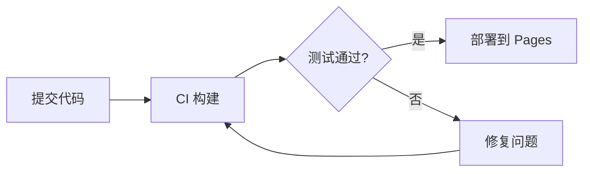
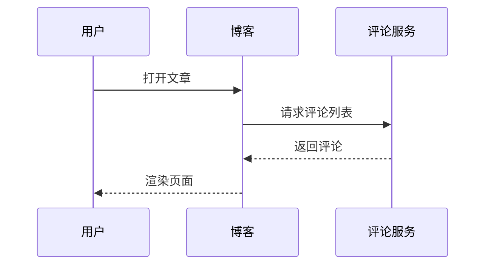

# 用 Mermaid 画架构图

写技术文章常常需要配图。Mermaid 的好处是图即代码，可以放进 Markdown、进版本库、跟着文章一起审阅。这个博客支持把标记为 `mermaid` 的代码块直接渲染成图。

## 流程图

下面是一个简单的发布流程：

## 时序图

多系统协作的调用关系适合用时序图：

## 小贴士

- 图尽量简单，一张图只讲一件事；
- 节点文字用中文没问题，但避免太长；
- 复杂的图拆成多张，读者更好消化。
