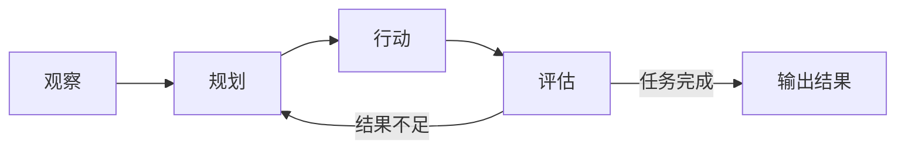

OpenClaw 能连上 Telegram、WhatsApp，替你收发消息、操作电脑；Hermes Agent 能记住跨会话的对话，甚至自己写新技能。功能差别这么大，但把外壳剥掉，两者的骨架是同一个东西：Agent Loop。

## Agent Loop 是什么

Agent Loop 是一个让模型"边想边做"的循环。模型不再只回答一句话，而是把任务拆成几步，每步决定调用哪个工具，拿到工具结果后决定下一步，直到任务完成。

最小实现大概是这样：

```python
while True:
    response = model.call(build_messages(history, tool_results))
    if response.has_tool_calls():
        for call in response.tool_calls:
            tool_results.append(run_tool(call))
        continue
    return response.text
```

循环里的每一步可以拆成四件事：观察当前状态（任务描述、工具结果），规划下一步，执行行动（调用工具），评估结果是否够好。不够好就回到规划，继续下一轮。



这个思路不是新东西。2022 年发表的 ReAct 论文（Yao et al., arXiv:2210.03629）就提出让模型交替进行推理和行动，把"想"和"做"串成同一个循环。今天的 Agent Loop 可以理解为 ReAct 思路的工程化实现。

## OpenClaw：一个消息进来，走完一整轮循环

OpenClaw 官方文档把 agent loop 定义为一个会话内串行执行的过程：intake（接收）→ context assembly（组装上下文）→ model inference（模型推理）→ tool execution（执行工具）→ streaming（流式回复）→ persistence（持久化）。

翻译成产品行为就是：你在 Telegram 里发一条消息，网关收到后，把技能和上下文文件注入 prompt，模型决定调用哪个工具，工具结果再喂回给模型，最后把回复发回 Telegram，整轮对话写入本地存储。循环按会话串行执行，同一个会话里不会有两个循环同时跑。

OpenClaw 的定位是自托管的网关，跑在你自己的机器上，通过插件连接 Discord、Telegram、Slack 等渠道。它由 Peter Steinberger 打造，前身叫 Clawdbot，中间改过名（Moltbot），最后定名 OpenClaw。项目 2025 年 11 月发布后迅速走红；2026 年 2 月 Steinberger 加入 OpenAI，项目转入 OpenClaw Foundation 继续以开源形式维护。（以上事实核实于 2026-08-08。）

## Hermes Agent：同一个循环，更厚的记忆层

Hermes Agent 由 Nous Research 开源，官方文档对循环的描述更直白：把用户消息追加到历史，构建 prompt，调用模型；如果模型返回工具调用，就执行工具、把结果追加回历史，然后回到调用模型这一步；如果模型返回纯文本，就把会话持久化，结束这一轮。默认情况下一个任务最多迭代 500 次。

Hermes 特别的地方在循环外面。它有跨会话记忆（FTS5 全文搜索）、用户画像，还会在使用过程中回顾经验、把可复用的做法沉淀成技能。这些能力都不改循环本身，只是让每一轮的起点更聪明：下一轮开始时，模型能拿到以前的经验。

## 内核和外围

把 OpenClaw 和 Hermes 放在一起看，结论很清晰：

- 内核是 Agent Loop，两个产品几乎一样，都是"调用模型，有工具就执行并继续，没有就返回"。
- 外围可以完全不同。OpenClaw 的外围是消息渠道和本地工具；Hermes 的外围是记忆、技能和自进化机制。

这也是理解 Agent 产品的一个实用框架：先找循环，再看外围。循环决定一个产品是不是 Agent，外围决定它好用不好用。

## 几个常见误解

一个常见误解是模型越强，Agent 就越强。循环里的工具质量、上下文管理和终止条件同样重要。OpenClaw 文档专门有一节讲超时和卡死会话诊断；Hermes 有迭代预算和上下文压缩机制。这些都是在循环边界上做的工程。

另一个误解是把 Agent 当成聊天机器人。两者的区别在循环是否继续：聊天机器人回答完就结束；Agent 拿到工具结果后会回到循环里再想一轮，直到它认为任务完成。

还有一种常见问题是忽视循环的终止条件。无限循环是真实存在的风险，OpenClaw 的社区 issue 里就出现过工具调用失败被自动重放、循环停不下来的案例。所以循环一定要有终止条件：迭代上限、超时，或者模型自己判断任务完成。

## 动手写一个最小 Agent Loop

如果你还没写过 Agent，可以从一个最简单的循环开始：让模型使用一个计算器工具，比如"计算 (1+2)*3 再除以 4"，模型先决定调用工具，你执行并把结果喂回去，直到模型给出最终答案。跑通之后再看 OpenClaw 或 Hermes 的源码，会发现你已经认识了它们的骨架。

## 参考来源

产品事实核实于 2026-08-08：

- [OpenClaw 官方文档：Agent Loop](https://docs2.openclaw.ai/concepts/agent-loop)
- [OpenClaw 官方文档：Overview](https://docs2.openclaw.ai/)
- [CGTN：OpenClaw founder Steinberger joins OpenAI, open-source bot becomes foundation（2026-02-16）](https://news.cgtn.com/news/2026-02-16/OpenClaw-founder-joins-OpenAI-open-source-bot-becomes-foundation-1KO684V1ew0/index.html)
- [openclaw/openclaw Issue #73781：Tool call replay loop](https://github.com/openclaw/openclaw/issues/73781)
- [Hermes Agent 官方文档：Agent Loop 内部机制](https://hermes-agent.nousresearch.com/docs/zh-Hans/developer-guide/agent-loop)
- [Hermes Agent GitHub 仓库：NousResearch/hermes-agent](https://github.com/NousResearch/hermes-agent)
- [Yao et al., ReAct: Synergizing Reasoning and Acting in Language Models, arXiv:2210.03629](https://arxiv.org/abs/2210.03629)
