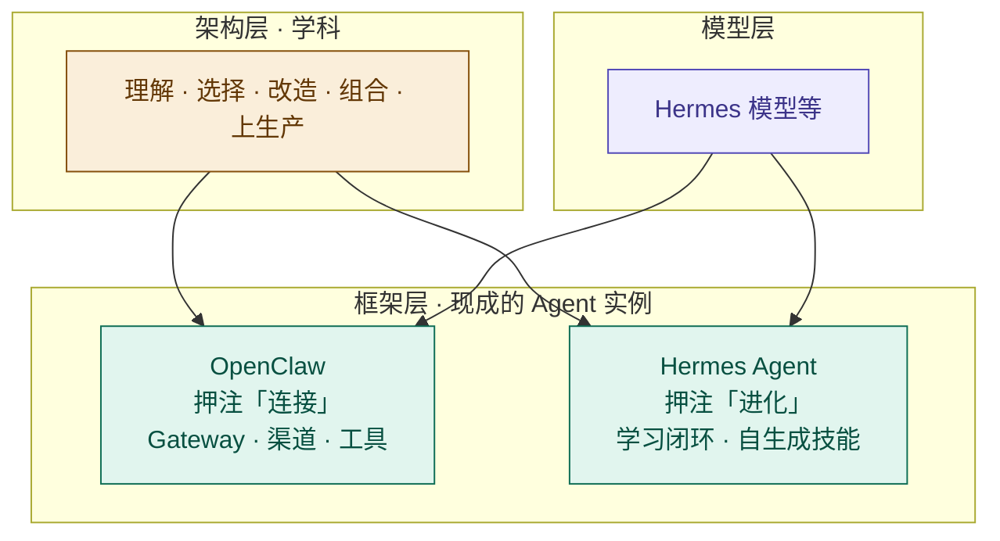

# 有了 OpenClaw 和 Hermes，为什么我们仍然需要 Agent 架构？

2026 年，自托管 Agent 框架已经把多渠道接入、工具调用、记忆和技能等能力包装得越来越完整：OpenClaw 围绕多渠道 Gateway 组织这些能力；Hermes Agent 则把学习闭环和可积累的技能放在更显眼的位置。既然有人把整个 Agent 都打包好了，我们还需要设计架构吗？

答案恰好相反：**OpenClaw 和 Hermes 不是架构的替代品，它们本身就是“某种 Agent 架构”的具体实例。** 这个问题的另一种问法是——“有了现成的车，为什么还需要机械工程？”车是机械工程的一个实例，而你要的业务可能不是这辆车。

为了不让讨论停在抽象层面，先定一个贯穿全文的场景：**Agent 处理订单退款**。用户说“帮我退掉昨天那单”，Agent 要完成的事远不止“调用一次退款工具”：

1. 识别订单和退款原因，确认订单、支付、履约状态；
2. 按金额、时效、商品类型判断是否允许自动退款；
3. 对高风险请求发起人工审批；
4. 执行退款并确认外部系统的最终状态；
5. 向用户说明结果，记录审计信息。

整个过程的关键不是模型生成了一段正确的回复，而是外部世界发生了正确、可追踪、可恢复的变化。这个场景恰好踩在框架默认答案的盲区上，后续每个架构决策都会回到它。

## 两个侧重点不同的架构实例

先看这两个框架各自押注了什么。

**OpenClaw**（前身 Clawdbot/Moltbot）更强调**连接**。它以 Gateway 为核心，统一连接聊天渠道、会话路由和工具执行；Agent 的人格与知识可由 Markdown 工作区文件承载，技能也可扩展。可以把它理解为偏中心辐射式（Hub-and-Spoke）的取舍：把渠道和会话连接汇聚到一个控制点，适合多端、多会话的个人助理场景。（以 2026-08-08 的官方文档为准：[OpenClaw 文档](https://github.com/openclaw/openclaw/blob/main/docs/index.md)）

**Hermes Agent**（Nous Research）更强调**进化**。它围绕 Agent Loop 提供学习闭环：复杂任务后可沉淀技能，技能可在使用中改进，并通过持久记忆、用户画像和会话检索积累上下文；会话搜索使用 SQLite FTS5。它同样提供多渠道 Gateway、MCP 和子代理能力，因此这里的“进化”是能力侧重点，而不是说它没有“连接”能力。（以 2026-08-08 的官方文档为准：[Hermes Agent 文档](https://github.com/NousResearch/hermes-agent)、[记忆机制说明](https://hermes-agent.nousresearch.com/docs/user-guide/features/memory/)）

注意这两行描述的每一个词——Gateway、控制平面、技能、记忆分层、学习闭环、停止条件——都是**架构决策**。框架没有消灭架构，而是把一组特定的架构决策固化成代码，替你做了选择。

三个层次各回答一个问题：

- **模型层**：想得有多聪明（推理、知识、指令遵循）；
- **框架层**：能碰到什么、能积累什么（渠道、工具、记忆、技能）；
- **架构层**：怎么可靠地把活干完（循环、护栏、观测、评测、运营）。

模型和框架解决前两个问题，而第三个问题恰恰是框架默认答案覆盖最弱、又最能决定生产成败的部分。

## 框架给默认，架构给决策权

框架的价值是替你做了大量合理默认，让个人助理场景开箱即用。但这些默认值是为“单用户、聊天入口、自托管”调好的，不是为你的业务调的。至少有四类决策，框架给了答案，但那个答案不一定是你的答案。

### 1. 循环与停止条件

- 框架默认：自主执行到“完成”为止，失败就重试。
- 你要决策：什么是“完成”的判据？最多执行几步？超过多少成本必须止损？什么情况升级人工？每一步是否可审计？

工具能调用不代表任务完成了。在退款场景里，“完成”的判据不是“退款接口返回成功”，而是“支付渠道确认资金已退回”——接口成功与最终到账之间隔着外部系统状态，必须通过查询支付单状态来验证。而“最多重试几次、超时多久升级人工”同样取决于业务语义：小额退款可以自动重试；大额退款一旦接口状态不确定，必须立即转人工审批，否则会留下“钱退了但系统不知道”的脏状态。停止条件不是模型能力问题，是业务语义问题，只能由你定义。

### 2. 记忆与状态

- 框架默认：内置记忆分层与文件策略（谁该写、何时写由 Agent 自行决定）。
- 你要决策：什么信息值得记？记忆由谁写入、如何防污染？多租户之间如何隔离？跨会话一致性怎么保证？

退款场景中，值得记的是“该用户的历史退款方式与偏好”，而“这次退款失败了”是会话内状态，不该被写进长期记忆——否则下次 Agent 会带着“上次退款失败了”的错误上下文去执行新请求。更关键的是隔离：不同用户、不同商家的退款记录绝不能互相串写，否则一次写错就可能拿着别人的订单状态去执行退款。个人助理的记忆写坏了可以重置；生产系统里记忆一旦污染，可能带着错误上下文执行真实操作。记忆策略是数据治理问题，不是 prompt 技巧。

### 3. 观测与评测

- 框架默认：可能提供日志、调试或基础追踪能力。
- 你要决策：关键轨迹是否全链路可追踪（trace 贯穿模型、工具、护栏）？有没有评测集和回归机制？成本与延迟有没有预算与告警？

退款链路必须有贯穿的 trace：模型选择了哪个工具、护栏放行了没有、支付接口返回了什么、为什么升级了人工——否则一次“误退大额订单”的事故根本无从复盘。评测集则来自历史退款决策：把过去人工审批过的案例（判对与判错的都要）沉淀成回归用例，每次换模型或改提示词都重跑一遍，才能知道“变得更聪明”是真话还是错觉。框架即使提供日志或追踪，也不会替你的业务领域定义审计字段、评测样本、成本预算和告警阈值。

### 4. 组合与迁移

- 框架默认：生态内自洽（自己的渠道、技能市场、配置格式）。
- 你要决策：工具契约是否标准（可对接 MCP 等开放协议）？后端模型是否可换？技能与记忆是否可导出？被单一框架锁定后，迁移成本是多少？

支付、履约、客服系统不会为了迁就某个 Agent 框架改造自己，所以退款工具层应优先用稳定契约（如 MCP 或内部 API）暴露，框架只做编排。这样切换 OpenClaw、Hermes 或其他编排层时，通常可以复用大部分工具输入输出；但认证、权限、错误语义和幂等策略仍可能需要适配。后端模型同理：退款决策的准确率跟着模型走，但你不想跟着某个模型供应商走。个人助理换框架的成本是“重新配一次”；生产系统换框架意味着重写编排、迁移记忆、重跑评测。

## 为什么框架替代不了架构

### 框架是观点，不是定律

OpenClaw 对渠道连接的强调，与 Hermes 对学习闭环的强调，代表两种**不同的架构取舍**；二者的能力也会持续重叠和演进。你选择哪一个、或者在什么条件下混用，本身就是架构决策。能把“选型”说清楚的人，依赖的正是架构判断力，而不是框架文档。

### 个人助理 ≠ 生产系统

这是最硬的一条。个人助理的场景是：单用户、聊天入口、可接受偶尔出错、记忆写坏重启即可。生产系统（订单、资金、履约）要求的是：幂等执行、失败补偿、人工升级链路、审计留痕、多租户隔离、成本预算、SLA。这些不是框架的卖点，也不会因为模型变强而自动出现——它们只能被架构出来。

### 可靠性是架构的产物

重试、回退、校验、护栏、停止条件、评测、观测——这些构成生产可靠性的东西，框架通常只能提供通用能力。决定“生产里出不出事”的，是你围绕业务语义自己写下的那部分，这正对应上一篇《[Agent 的最小闭环：模型、工具、指令与 Guardrails](/posts/agent-loop-tools-and-guardrails)》的论点：循环、工具、护栏、停止条件缺一不可。

### 模型会换代，骨架长存

更强模型只会让“想”这一步更便宜、更聪明，但状态管理、记忆策略、工具编排、错误恢复、可观测性不会因为模型变强而消失——反而会因为 Agent 能做的事变多而更关键。架构是持久层，模型和框架都是可换件。把投资放在可换件上，是另一种形式的负债。

## 落到实践：用框架，但不被框架定义

一个可操作的判断路径：

1. **场景是个人助理**（自己用、接渠道、要记忆）——直接用 OpenClaw 或 Hermes，别重造轮子，这是框架的主场。
2. **场景是内部工具**（单团队、低风险、可容忍出错）——框架起步，但要尽早补上轨迹日志和简单评测，为将来留后路。
3. **场景是生产业务**（订单、资金、合规、多租户）——把框架当组件而不是答案：明确停止条件与人工升级路径，定义记忆与隔离策略，建立评测集与观测，用标准契约（如 MCP）隔离工具层，保证后端与框架可替换。把上文的退款场景放进去：自动退款的金额上限、升级人工的路径、历史退款评测集——这些都不会由框架替你定。

判断“该用框架还是该自己写”，标准只有一个：**你的业务是否愿意接受框架的默认答案。** 愿意，就用；不愿意，就改造或自研——而知道差距在哪、差距有多大，就是架构能力的全部意义。

## 结语

OpenClaw 和 Hermes 让“搭一个 Agent”变得便宜，这是好事。但便宜来自它们替你消化了架构决策，而不是架构本身消失了。用框架是起点，把框架当组件而不是当答案，才是 Agent 工程与“组装 Prompt”之间的分水岭。
