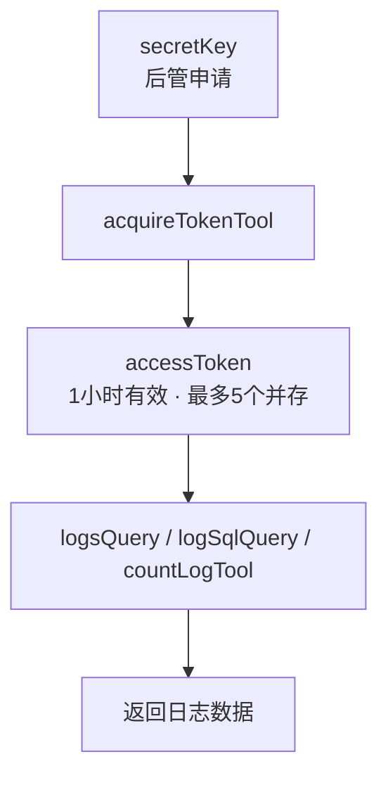
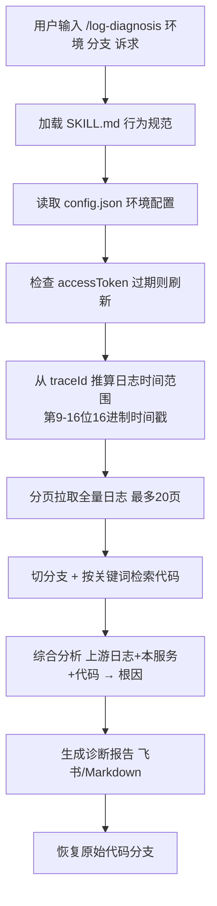

# 固定流程自动化的 Skill 设计：用「协议 + 规范」让 AI 接管重复劳动（解读）

> **原文来源**：得物技术（tech.dewu.com）
> **作者**：原文未署名（编辑：技术运营）
> **发布时间**：2026-07-08
> **原文链接**：https://tech.dewu.com/article?id=219
> **一句话概括**：把"查日志 → 找关键信息 → 扫描代码 → 定位问题"这条固定调试流程，用「MCP（数据接入协议）+ Skill（行为规范）」两个组件封装为一条 `/log-diagnosis` 命令，AI 一键完成 BUG 根因诊断。
> **业务场景**：后端日常 BUG 定位（日志平台与 IDE 之间反复切换）——本文解读时将其作为案例，提炼"如何把固定流程自动化为可复用的 AI 能力"这一通用设计思路。

---

## 一、自动化起点：识别"固定流程"而非"单个环节"

原文开场描绘了后端调 BUG 的日常：打开日志平台输入 traceId 搜日志 → 从几十上百条日志里挑出关键几条 → 复制类名/方法名去 IDE 找代码 → 结合代码逻辑判断问题 → 找不准再回头搜。文章直言，光在日志平台和 IDE 之间来回切换，就能消耗掉大半时间。

这个痛点之所以值得自动化，不是因为它"累"，而是因为它**满足三个结构特征**：

| 特征 | 本例中的体现 |
|------|--------------|
| 步骤固定 | 每次都是"查→挑→找→判→复"同一套动作 |
| 信息来源明确 | 日志平台（traceId）、代码仓库，数据源确定 |
| 输出可预期 | 结论形态固定：根因 + 修复方案 |

- **通用解法**：凡是同时满足这三条的工作，都值得尝试 Skill + MCP 自动化——代码审查、性能分析报告生成、告警巡检等同类候选皆如此。**边界**：高度非结构化、依赖创造性判断的工作不适合强流程化。
- **原文实现**：作者最初设想 Cursor + MCP + 代码知识库，因两个缺陷放弃——① 日志查询是"动态的"，依赖环境、应用、时间范围，**无法静态预置**；② 这样无法丝滑地读代码、改代码。直到接触 Claude Code 的 Skill 概念（在项目里定义自定义命令、描述 AI 如何执行每一步），思路才清晰：MCP 管数据、Skill 管行为，二者组合成完整闭环。

这段演进本身就是一个可迁移的决策框架：**先判断"缺数据还是缺流程"**——只缺数据源 → 接 MCP/API；缺流程规范 → 写 Skill/SOP；两者都缺 → 组合。与其在单个工具上反复折腾，不如把问题拆成"接入"与"规范"两个正交维度分别解决。

---

## 二、数据接入层：日志平台 MCP，让 AI 拿到"活的"数据

原文用一整节讲数据接入层——这是闭环的地基。

**MCP 原理**：MCP（Model Context Protocol）是标准化的「工具调用协议」，日志平台据此推出日志查询服务，Claude 可直接调用，无需人工在平台上手动查询。Claude Code 通过 SSE（Server-Sent Events）长连接与 MCP Server 通信，**实时**获取日志数据。

**鉴权流程（原文的关键设计）**：

如图所示，长期密钥只在申请环节人工介入，之后每次调用都用短期令牌鉴权，令牌自动获取、到期自动刷新。

**queryString 语法**：`{field} {操作符} "{值}" {连接符} ...`——操作符 `=` 精确匹配、`≈` 模糊匹配（like）；连接符 `AND / OR / NOT`；**时间范围只通过 start/end 参数控制，不写进 queryString**（这是避免查询语法与时间逻辑耦合的细节约定）。

- **通用问题 1：Agent 如何处理"无法预先塞进上下文"的动态数据？** → **通用解法**：用标准化的工具调用协议（MCP/API）把外部系统能力暴露给 Agent，数据在需要时实时获取。**"接入协议"取代"静态预置"，是 Agent 处理日志、监控、订单等动态数据的通用前提**。
- **通用问题 2：Agent 访问外部系统的凭证如何管理？** → **通用解法**：凭证分层——长期密钥（secretKey，唯一人工申请）+ 短期令牌（accessToken，自动获取、自动刷新、限制并存数量）。"1 小时有效、最多同时存在 5 个"是典型的令牌生命周期约束，把泄露面压缩到最小，可迁移到任何 Agent 接外部系统（监控、CI、数据库）的场景。

---

## 三、行为规范层：/log-diagnosis Skill，把排查经验写成 AI 的操作手册

数据能拿到了，AI 还"不知道怎么做"——Skill 解决的就是这个。原文核心的执行链路如下：

如图所示，整条链路从命令触发到报告产出再到现场恢复，全部由 Skill 文件定义的步骤顺序驱动。

**Skill 的物理形态**：`your-project/.claude/skills/log-diagnosis/` 下三个文件——`SKILL.md`（行为规范，核心）、`README.md`（使用说明）、`reference.md`（附录：时间脚本、queryString 示例等）。

**配置自管理（原文的亮点）**：`.diagnosis/config.json` 中，**secretKey 是唯一人工填写的字段**；accessToken、accessTokenExpireAt 由 AI 自动调用 acquireTokenTool 获取/填充，fields 由 logFields 工具自动探测。首次运行还会自动引导创建配置文件。

**使用方式**：`/log-diagnosis {环境} {代码分支（可选）} {诉求描述}`——环境 T1/PRE/PRD；诉求用自然语言写，如 `/log-diagnosis PRD master 告警详情：... 帮我分析问题可能性`。**入口极简，复杂度全部藏在规范里**。

- **通用问题**：AI 执行质量不稳定，如何把资深工程师的排查经验沉淀为团队可复用的稳定能力？
- **通用解法（SOP 三要素）**：Skill 的本质是「给 AI 写操作手册」，不是训练模型。规范要写三类内容，写得越细、约束越明确，AI 执行越稳定：
  - **步骤顺序**：取配置 → 验 token → 算时间窗 → 拉日志 → 检索代码 → 综合判断 → 出报告 → 恢复现场；
  - **硬性约束**："禁止只查第一页就下结论""必须分页拉完（最多 20 页）""用完后恢复原始代码分支"——这类不可妥协的规则是质量稳定的关键；
  - **分支处理**：token 过期自动刷新、一次找不准的兜底路径。
- **迁移映射**：任何"把个人/团队经验固化为可复用能力"的场景都适用（代码审查、告警巡检、报表生成）；**边界**：SOP 覆盖不到的新情况仍需人介入；Skill 是活资产，需随系统演进持续迭代，否则会过时。

---

## 四、实战验证：一个隐蔽 SQL BUG 的完整诊断链路

原文用一整节实战验证闭环，这是全文最有说服力的部分。

**背景**：某搜索接口在测试环境反馈没有返回数据。用户只输入一行命令 `/log-diagnosis T1 feature/your-branch trace_id: "your-trace" 为什么最终没有返回数据`，接下来全部交给 AI。AI 自动完成五步：

如图所示，AI 沿着"日志事实 → 链路定位 → 参数还原 → SQL 比对 → 代码修复"的证据链逐层收敛，每一步都基于运行时事实而非代码推断。

1. **拉日志**：从 traceId 推算时间范围（2026-02-27 全天）；检测 accessToken 过期并自动刷新；分 2 页拉取完整日志共 73 条；
2. **还原调用链路**：识别关键节点 `resultList is empty` → SQL 查询返回空结果 → **问题在 DB 层，不在业务逻辑层**；
3. **提取执行事实**：从日志还原请求入参与 toSearchDTO 组装结果（channelType / customerTag / deliveryMode / orderStatus / orderType / ticketSource / ticketTypeId 等字段）；
4. **发现根因**：ORM 在日志中打印了实际执行的 SQL，AI 直接读取分析——其他字段（order_types / delivery_modes / ticket_sources 等）都处理了 `IS NULL OR = ''` 两种情况（空字符串代表"不限制"），唯独 `customer_tag` 只判断了 `IS NULL OR a.customer_tag = 1`，**遗漏了空字符串 ''**。DB 中 customer_tag 字段均为空字符串（未配置），按业务语义本应匹配所有请求，却被全部过滤；
5. **定位代码给方案**：直接找到 MyBatis Mapper XML，在 `<if test="customerTag != null">` 中补上 `OR a.customer_tag = ''`。

**原文金句**："这个 BUG 的隐蔽性在于：SQL 语法正确，逻辑上也「看起来」没问题——只有对比了其他字段的写法，才能发现 customer_tag 独自遗漏了空字符串的处理。这类细节差异，人工排查很容易忽略，AI 反而很擅长。"

**通用化提炼（双视角）**：

| 原文实现 | 抽象后的通用解法 | 适用场景 / 边界 |
|----------|------------------|-----------------|
| 从 traceId 推算时间窗口（第 9-16 位十六进制时间戳） | **请求级追踪标识锁时间窗**：用内嵌时间戳的 requestId 把检索从全时段盲扫收敛到单请求窗口 | 任何自带 requestId 的分布式系统；边界：依赖 traceId 规范内嵌时间戳 |
| 优先读 ORM 打印的实际 SQL、实际参数、关键节点 | **证据链式根因分析**：运行时事实优先于代码推断，多源交叉验证后再下结论 | 数据/查询类问题排查；边界：依赖日志质量，不打 SQL 就看不了事实 |
| 逐字段对比 customer_tag 与同类字段的 SQL 写法 | **横向一致性审查**：让 AI 对同类模式逐一审查、找出"一处遗漏"型差异 | SQL 条件一致性、配置完整性、参数校验一致性审查；边界：需要同类参照物存在，孤例逻辑无法发现 |

AI 在这类任务上的优势来源：**没有"这段代码看起来没问题"的先入为主经验偏见，会对所有对象做同等程度的审查**——这是"横向对比"型任务 AI 天然强于人工的根本原因。

---

## 五、诊断效率四条纪律：一份可复用的排查 SOP

原文把诊断效率的经验浓缩为四点，本身就是一份通用的"日志诊断 SOP"：

1. **有 traceId 优先用 traceId**：精准获取单次请求的完整链路，比关键词搜索精确得多——通用思路：**请求级追踪标识优于关键词盲搜**；
2. **关注关键日志节点**：toSearchDTO finished / search begins / resultList is empty / search finished——快速判断数据在哪一层丢失——通用思路：**业务链路的关键里程碑埋点化，是分层定位的前提**；
3. **SQL 打印日志是黄金线索**：ORM 输出直接反映最终执行的查询条件，AI 能从中发现肉眼难以察觉的差异——通用思路：**诊断能力的天花板取决于"执行事实"的暴露程度（日志质量）**；
4. **分页必须拉完**：日志平台一次只返回部分数据，严格执行分页直到取完，确保不遗漏——通用思路：**完整性约束——数据不全不下结论**。

这四条的价值在于：它们不是"技巧"，而是**把隐性经验显式化写入 Skill 规范**——这正是 Skill 能稳定复现资深工程师水平的原因。

---

## 六、总结：用「协议 + 规范」让 AI 接管固定流程

原文的收束结论：**用「协议 + 规范」让 AI 接管固定流程**。两个关键组合缺一不可：

- **MCP**：让 AI 能调用外部系统（日志平台），突破"AI 只能处理静态上下文"的限制，实现动态数据实时获取；
- **Skill**：给 AI 一份行为规范，告诉它每一步怎么做、先做什么后做什么、遇到什么情况怎么处理，把"一次性对话"变成"可复用的工程化能力"。

**"只有 MCP，AI 能查日志但不知道怎么系统地分析；只有 Skill，AI 有流程但没有数据来源。"**

可迁移的方法论：

1. 识别「固定流程」是自动化的起点——步骤固定、信息来源明确、输出格式可预期的工作，都值得尝试 Skill + MCP 自动化；
2. Skill 的本质是「给 AI 写操作手册」——写得越细、约束越明确（禁止只查第一页、必须拉完分页），AI 执行质量越稳定；这和写给人看的文档本质上是一回事；
3. AI 擅长「横向对比」类问题——没有先入为主的偏见，对同类逻辑做同等审查，反而能发现人工容易忽略的细节差异；
4. AI 时代工程师的核心竞争力，不只是"能写代码"，更是"能把自己的经验和流程转化成可复用的 AI 能力"。

---

## 七、延伸思考（个人整理）

1. **可迁移性评估——成本低、见效快**：这套"Skill + MCP"模板迁移成本很低。团队日志/监控平台能暴露 MCP（或至少有可查询 API），半天内可复刻一个诊断 Skill；没有 MCP 基础设施的，可用"本地脚本 + 文档化 SOP"降级替代（实时性与平滑度差一些）。
2. **设计亮点**：① traceId 内嵌时间戳推导时间窗口（第 9-16 位十六进制），把检索从盲扫收敛到单请求窗口——任何自带 requestId 的系统都可复用；② "最多 20 页"既是完整性约束、也是防失控保护；③ config.json 单一人工输入点（secretKey）是"人工介入点收敛"的简洁实现；④ queryString 中不写时间范围，把"时间语义"与"查询语义"解耦，是容易被忽略的规范设计。
3. **与同批解读的互相印证**：《复杂业务团队的 AI Coding 交付实践》讲"研发流程文件化 + 门禁前置"，《Reducer 模式状态注入详解》讲"决策与状态解耦"，本篇讲"调试流程 Skill 化 + 约束显式化"——共同内核都是**把人的流程与决策沉淀为可执行的规范资产**，"流程即资产"是这批文章一致的元结论。
4. **局限与代价**：效果强依赖日志质量（SQL 打印、关键节点埋点不全时"看事实"无从谈起）；"最多 20 页"在极端流量下可能截断；跨服务自动识别依赖日志平台关联能力；secretKey 落盘 config.json 存在凭证泄露风险，需权限管控；AI 的修复建议仍需人确认业务语义后再合入。
5. **落地建议——小团队三件套**：① 让日志平台暴露 MCP 或可查询 API；② 写一个"日志诊断" Skill，约束三句话（分页拉全、先看事实、横向对比）；③ 把 SQL/关键节点日志打全。先覆盖"运行类 BUG"排查这一最高频场景，跑通后再向代码审查、告警巡检扩展。
