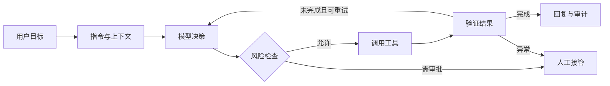

# Agent 的最小闭环：模型、工具、指令与 Guardrails

很多 Agent Demo 看起来已经“能工作”：模型理解用户意图，选择一个工具，然后返回结果。但能调用工具和能进入生产之间，还隔着一整套工程闭环。

OpenAI 的 Agent 构建资料把核心原语概括为模型与指令、工具、Handoff、Guardrail 和 Session，并强调通过 Trace 还原工具调用和边界触发过程。本文不复述 SDK 用法，而是从工程视角回答一个问题：**什么才是一个可以持续演进的最小 Agent？**

> 参考资料：[Building agents](https://developers.openai.com/tracks/building-agents) 与 [Using tools](https://developers.openai.com/api/docs/guides/tools)。

## 先定义闭环，而不是先选模型

以“退款审批”为例。用户说“帮我退掉订单”，真正的业务过程至少包含：

1. 识别订单和退款原因；
2. 查询订单、支付和履约状态；
3. 根据金额、时效和商品类型判断是否允许自动退款；
4. 对高风险请求发起人工审批；
5. 执行退款并确认外部系统的最终状态；
6. 向用户说明结果，记录审计信息。

这个过程的关键不是模型生成了一段正确的话，而是外部世界是否发生了正确、可追踪、可恢复的变化。



因此，一个最小闭环至少要能回答四个问题：下一步由谁决定、能够执行什么、哪些动作不能自动执行、什么时候结束或交给人。

## 四个基本构件

### 1. 模型：负责不确定性判断

模型适合处理意图识别、信息归纳、下一步选择等无法完全用固定规则覆盖的环节。金额上限、权限校验、订单状态机等确定性约束不应交给模型“记住”。

工程上的分界很简单：**需要语义判断的交给模型，需要严格保证的写进代码和策略。**

### 2. 指令：定义目标、边界和优先级

有效的指令不只是角色描述，而是一份运行契约，至少需要说明：

- Agent 的业务目标与完成标准；
- 可以使用哪些信息和工具；
- 缺少参数时如何补充；
- 哪些情况必须拒绝、停止或升级人工；
- 工具失败、结果冲突时如何处理。

指令不能替代权限系统，但它能让模型在允许的空间内做出更稳定的选择。

### 3. 工具：把能力收敛成可验证的动作

工具越多不代表 Agent 越强。工具名称含糊、参数宽松、返回结果不稳定，会把业务复杂度重新丢回给模型。

一个可用的工具契约应当满足：

```json
{
  "name": "create_refund_request",
  "description": "创建退款申请；不直接完成打款",
  "input": {
    "order_id": "明确格式的订单号",
    "reason_code": "受控枚举",
    "amount": "大于 0 且不超过可退金额"
  },
  "output": {
    "request_id": "退款申请编号",
    "status": "pending | approved | rejected"
  }
}
```

这里最重要的是把“创建申请”和“实际退款”拆开。前者可以低风险自动化，后者可能需要审批。工具边界本身就是风险边界。

### 4. Guardrails：在关键路径上机械化执行规则

Guardrail 不应只做敏感词过滤。生产系统通常需要多层防线：

| 位置 | 需要检查什么 | 退款示例 |
| --- | --- | --- |
| 输入前 | 身份、格式、注入和数据权限 | 当前用户是否拥有该订单 |
| 决策前 | 业务规则和可执行范围 | 是否超过自动审批金额 |
| 工具前 | 参数、授权、幂等和影响范围 | 同一订单是否已发起退款 |
| 工具后 | 返回状态和副作用 | 支付系统是否真实受理 |
| 输出前 | 隐私、合规和事实一致性 | 不泄露内部风控原因 |

高风险动作还应保留审批、审计、限流、预算、回滚或补偿路径。把这些规则只写在 Prompt 中，无法提供确定性保证。

## 控制循环必须有停止条件

Agent Loop 的核心不是“不断让模型思考”，而是每轮都根据状态决定继续、完成还是退出。可以把控制逻辑抽象成：

```text
while 未达到完成条件:
    检查轮次、时间和成本预算
    让模型基于当前状态选择下一步
    校验工具权限与参数
    执行工具并记录 trace
    验证外部系统状态
    若风险升高或连续失败，则转人工

生成基于真实执行结果的最终回复
```

至少需要设置最大轮次、总耗时、成本上限、连续失败次数和重复调用检测。否则一次工具异常就可能演化成无意义重试、重复副作用和不可控成本。

## 什么时候需要多 Agent

不要因为流程里有多个步骤，就立即拆成多个 Agent。单 Agent 配合少量清晰工具，通常更容易测试、追踪和治理。

只有出现以下信号时，才值得考虑 Handoff 或管理者—执行者模式：

- 不同阶段需要明显不同的权限；
- 专业上下文过大，放在一个 Agent 中会互相干扰；
- 某一子任务需要独立评测和扩缩容；
- 团队边界要求不同服务分别负责。

多 Agent 解决的是职责和上下文隔离问题，不是“让系统看起来更智能”。

## 上线前检查清单

- 任务完成是否由外部状态验证，而不是由模型自我声明；
- 每个工具是否拥有明确输入、输出、错误码和幂等策略；
- 高风险工具是否默认最小权限，并配置人工审批；
- 是否记录模型决策、工具参数、结果、耗时和边界触发信息；
- 是否限制轮次、时间、成本和重复调用；
- 工具超时、部分成功和下游不可用时是否有补偿方案；
- 是否可以用固定样本回放关键路径；
- 是否明确了自动执行与人工接管的分界。

## 我的结论

Agent 的最小闭环不是“模型 + Function Calling”，而是：

> 模型负责处理不确定性，工具负责执行受约束的动作，Guardrails 负责机械化边界，编排负责停止、验证和交接。

先把单 Agent 的工具契约、状态验证和失败路径做扎实，再考虑更复杂的自治和多 Agent 架构。可靠性通常不是来自更多模型调用，而是来自更清晰的边界和更短的反馈回路。

<AuthorCard />
