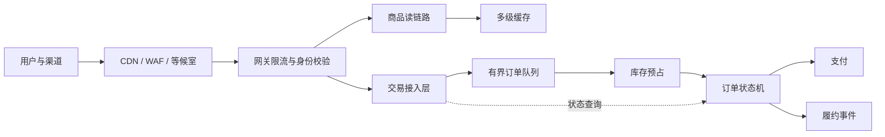
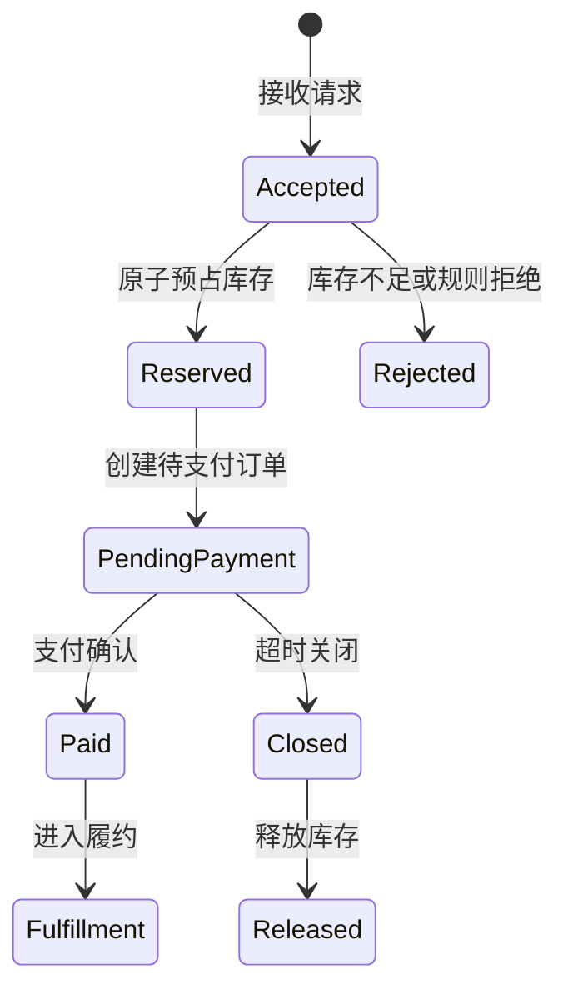

# 电商大促不是扩容比赛：从流量洪峰到订单闭环的系统保护设计

电商大促最危险的误区，是把它理解成一次服务器扩容：流量预计增长几倍，机器就增加几倍。

真正进入交易链路后，系统面对的不是均匀流量，而是短时间集中爆发、少数商品形成热点、用户重复点击、客户端重试、支付与库存等外部依赖限额共同叠加。任何一个环节开始变慢，等待中的请求都会继续占用线程、连接和内存，最终把局部瓶颈放大成级联故障。

公开案例也呈现出相似规律：AWS 的 Flash Sale 指南强调从业务目标、SKU、渠道、第三方依赖和服务配额反推容量；ZOZOTOWN 的购物车改造使用队列控制进入后端的速率，并用状态与条件写避免重复处理；Google SRE 则指出，过载后的无节制重试会继续放大故障。[AWS Flash Sale 指南](https://aws.amazon.com/blogs/mt/top-considerations-for-flash-sale-events/)、[ZOZOTOWN 购物车案例](https://aws.amazon.com/blogs/database/how-amazon-dynamodb-supported-zozotowns-shopping-cart-migration-project/)、[Google SRE：级联故障](https://sre.google/sre-book/addressing-cascading-failures/)

本文基于这些公开方法重新设计一个通用化大促方案。**文中的流量比例和阈值均为教学化假设，不对应任何具体公司，也不代表个人项目业绩。**

## 先定义目标：保护有效交易，而不是保护所有请求

大促期间，系统不可能承诺每项功能都与平时体验一致。工程团队首先要与业务确认优先级：

| 优先级 | 链路 | 目标 |
| --- | --- | --- |
| P0 | 库存、下单、支付结果 | 正确、幂等、可追踪 |
| P1 | 登录、购物车、商品详情 | 可用，允许轻微延迟 |
| P2 | 搜索、优惠计算、地址服务 | 可降级但不能阻断交易 |
| P3 | 推荐、评论、排行榜、实时大屏 | 必要时关闭 |

这个排序决定了资源隔离、限流和降级策略。大促成功不是“所有接口都返回 200”，而是有限容量持续转化为正确订单。

## 一、不要只估总流量，要逐层建立容量模型

假设日常流量记作 `1x`，活动预热阶段约为 `3x`，开场瞬时峰值按 `8x` 设计，再为预测误差保留安全余量。这些倍数只用于演示，实际值应由历史活动、投放计划、SKU 数量和用户路径共同推导。

容量模型至少拆到以下层级：

```text
活动触达人数
  × 到站率
  × 商品详情访问率
  × 加购率
  × 提交订单率
  × 平均每次操作产生的后端调用数
  × 重试与异常放大系数
```

每一层都要回答四个问题：

1. 单实例稳定处理能力是多少；
2. 瓶颈首先出现在 CPU、线程池、连接池、缓存还是数据库；
3. 云服务、短信、支付、风控和物流接口是否存在配额；
4. 超过容量后，系统会快速拒绝，还是在高延迟中缓慢失效。

扩容只对无状态且瓶颈可横向拆分的环节有效。数据库连接、热点库存行、第三方支付限额不会因为应用实例增加就自然消失，甚至可能承受更高并发。

## 二、用分层架构把流量挡在正确的位置



### 边缘层：先拦掉无效和超额流量

静态资源和商品展示尽量由 CDN 承担；WAF、设备指纹和行为规则用于识别明显的机器人和异常请求；当交易系统接近容量上限时，等候室按可控速率放行，而不是让请求全部进入应用后排队。

限流维度不应只有 IP。大促场景通常还需要组合用户、设备、活动、SKU 和接口维度，否则大量用户访问同一爆款时，热点依然会穿透到最深层。

### 读取层：缓存热点，但不要把缓存当事实来源

商品标题、图片和活动规则适合缓存；可售库存则需要区分“展示值”和“交易事实”。页面上的“仅剩少量”可以是近似值，真正的扣减必须在交易链路中原子判断。

对于爆款 SKU，可以提前预热缓存、识别热 Key，并使用请求合并避免缓存失效瞬间大量请求同时回源。热点治理的目标不是缓存命中率本身，而是保护后端存储的稳定吞吐。

### 交易层：排队的意义是控制速率

队列不能创造容量，只能吸收短时突发并把后端处理速率控制在安全水位。必须同时设置：

- 最大队列长度；
- 请求有效期；
- 单用户和单 SKU 的排队上限；
- 超时后的明确失败状态；
- 队列积压告警与快速关闭入口。

无界队列只是把“立即失败”改成“很久以后失败”，还会让用户在等待期间继续点击并产生更多请求。

## 三、把库存和订单设计成可恢复的状态机

大促交易最怕三类问题：超卖、重复订单和“用户看到失败但后台实际成功”。它们都不能靠前端按钮置灰解决。

一个简化的订单闭环可以这样设计：



关键约束包括：

1. 客户端为一次购买意图生成幂等键；
2. 服务端用“用户 + 活动 + SKU + 幂等键”识别重复提交；
3. 库存预占使用原子条件更新，失败就明确结束；
4. 消息消费者按至少一次投递设计，重复消息不能重复扣减；
5. 支付回调、主动查询和订单状态机最终收敛到同一事实；
6. 超时订单通过补偿任务释放库存，并保留审计轨迹。

这类设计与 ZOZOTOWN 案例中的状态管理和条件写思路一致：消费者先检查状态，只有满足前置条件时才推进处理，从机制上避免重复记录造成重复副作用。

## 四、过载时要主动降级，并管住重试

系统接近极限时，“努力处理所有请求”通常会得到最差结果。正确做法是尽早丢弃低价值工作，把容量留给已进入交易闭环的请求。

推荐的降级顺序是：

1. 关闭个性化推荐、评论摘要和排行榜；
2. 商品详情返回预生成或缓存版本；
3. 搜索减少聚合与排序复杂度；
4. 非关键营销计算改为活动后补偿；
5. 新交易进入等候室，已经受理的订单继续推进；
6. 支付和库存异常时停止继续放量。

重试必须遵守三个原则：只重试明确的临时错误、使用指数退避与随机抖动、设置单请求和服务级重试预算。不要在网关、服务和 SDK 三层同时重试。Google SRE 给出的典型问题是，多层重试会形成乘法放大，让少量错误迅速变成压垮后端的新流量。

## 五、压测要模拟业务分布，而不只是制造 QPS

一次有效的大促压测应该包含：

- 预热、爬坡、瞬时峰值和峰后回落；
- 少数爆款承受大部分请求的倾斜分布；
- 登录、浏览、加购、下单、支付的真实比例；
- 缓存失效、数据库慢查询、消息堆积和第三方超时；
- 用户重复点击、客户端超时重试和机器人流量；
- 限流、降级、扩容、故障切换和恢复过程。

阿里云公开的飞猪双 11 实践提到多轮全链路压测、热点依赖迁移和大任务资源隔离。这类经验的核心不是某个中间件，而是压测必须覆盖完整依赖关系，并主动验证热点和资源争抢。[飞猪双 11 实时数据实践](https://www.alibabacloud.com/blog/second-level-response-time-achieved-in-fliggy%E2%80%99s-double-11-real-time-data-big-screen-by-hologres_597913)

压测结束后应产出每个关键服务的安全水位，而不是只给出一个“系统最高 QPS”。

## 六、现场保障看三张图和一份 Runbook

大促看板至少分成三层：

| 看板 | 核心指标 |
| --- | --- |
| 业务结果 | 下单成功率、支付成功率、库存拒绝率、订单状态分布 |
| 系统健康 | P95/P99、错误率、饱和度、连接池、缓存命中率 |
| 异步链路 | 队列积压、最老消息年龄、消费速率、重复与补偿数量 |

告警必须对应动作。例如“队列最老消息持续增长”之后，是减少放量、扩容消费者还是关闭活动入口，应当在 Runbook 中提前写清楚。现场负责人需要拥有执行限流、降级、回滚和停止活动的明确权限。

一个完整节奏通常包括：

- **活动前**：容量评审、配额确认、全链路压测、预案演练、变更冻结；
- **活动中**：统一指挥、按阶段放量、观察业务与技术指标、记录操作；
- **活动后**：核对订单和库存、处理补偿、恢复资源、复盘并更新基线。

## 我的结论

大促稳定性不是“准备足够多机器”，而是建立一套能够主动收敛风险的系统：

> 用容量模型识别边界，用分层准入控制流量，用状态机保证交易正确，用限流降级保护有效吞吐，用压测和 Runbook 验证整个组织能够在压力下行动。

系统真正成熟的标志，不是它从不出现峰值和故障，而是峰值到来时仍然知道哪些请求必须成功、哪些功能可以牺牲、失败后如何恢复。

## 参考资料

- [Top considerations for Flash sale events · AWS](https://aws.amazon.com/blogs/mt/top-considerations-for-flash-sale-events/)
- [How Amazon DynamoDB supported ZOZOTOWN’s shopping cart migration project · AWS](https://aws.amazon.com/blogs/database/how-amazon-dynamodb-supported-zozotowns-shopping-cart-migration-project/)
- [Addressing Cascading Failures · Google SRE](https://sre.google/sre-book/addressing-cascading-failures/)
- [Second-Level Response Time Achieved in Fliggy’s Double 11 Real-Time Data Big Screen · Alibaba Cloud](https://www.alibabacloud.com/blog/second-level-response-time-achieved-in-fliggy%E2%80%99s-double-11-real-time-data-big-screen-by-hologres_597913)

<AuthorCard />
