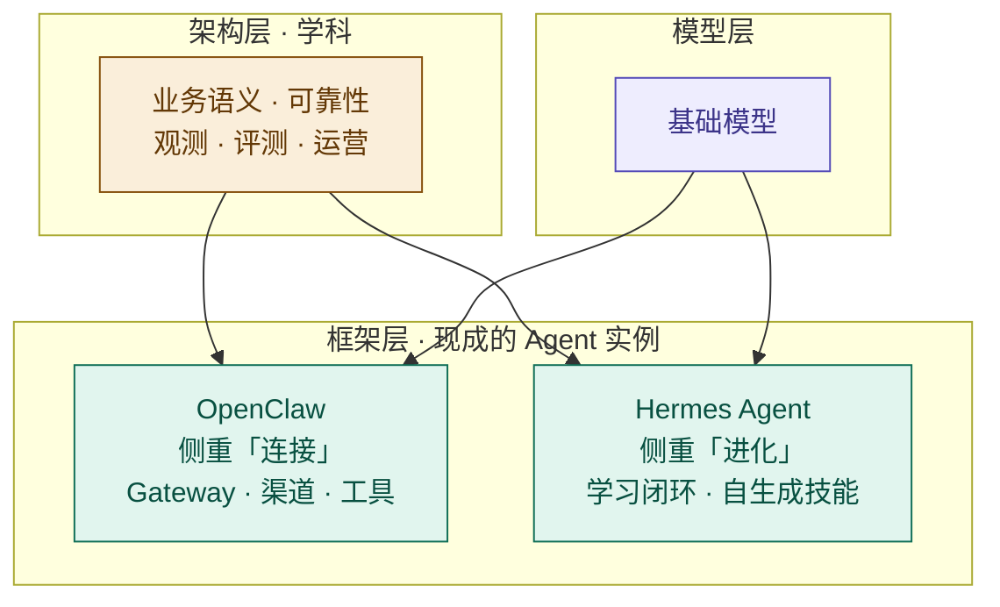

# 有了 OpenClaw 和 Hermes，为什么我们仍然需要 Agent 架构？

2026 年，自托管 Agent 框架已经把多渠道接入、工具调用、记忆和技能等能力包装得越来越完整：OpenClaw 围绕多渠道 Gateway 组织这些能力；Hermes Agent 则把学习闭环和可积累的技能放在更显眼的位置。既然有人把整个 Agent 都打包好了，我们还需要设计架构吗？

OpenClaw 和 Hermes 已经替使用者做了一批架构选择，但这些选择服务于通用场景。到了具体业务里，团队仍要判断哪些默认值可以接受，哪些必须改。

为了不让讨论停在抽象层面，先定一个贯穿全文的场景：**Agent 处理订单退款**。用户说“帮我退掉昨天那单”，Agent 要完成的事远不止“调用一次退款工具”：

1. 识别订单和退款原因，确认订单、支付、履约状态；
2. 按金额、时效、商品类型判断是否允许自动退款；
3. 对高风险请求发起人工审批；
4. 执行退款并确认外部系统的最终状态；
5. 向用户说明结果，记录审计信息。

退款任务是否完成，取决于订单和支付系统是否进入正确、可追踪、可恢复的状态。模型回复得像不像客服，反而是次要问题。后面的架构决策都会回到这条退款链路。

## 两个侧重点不同的架构实例

先看这两个框架各自更重视什么。

**OpenClaw**（前身 Clawdbot/Moltbot）更强调**连接**。它以 Gateway 为核心，统一连接聊天渠道、会话路由和工具执行；Agent 的人格与知识可由 Markdown 工作区文件承载，技能也可扩展。可以把它理解为偏中心辐射式（Hub-and-Spoke）的取舍：把渠道和会话连接汇聚到一个控制点，适合多端、多会话的个人助理场景。（资料：[OpenClaw 官方文档，2026-08-08 核对](https://github.com/openclaw/openclaw/blob/fa0fcef9f624f156e723ce10eeaf06fbfa3a7231/docs/index.md)）

**Hermes Agent**（Nous Research）更强调**进化**。它围绕 Agent Loop 提供学习闭环：复杂任务后可沉淀技能，技能可在使用中改进，并通过持久记忆、用户画像和会话检索积累上下文；会话搜索使用 SQLite FTS5。Hermes 同样提供多渠道 Gateway、MCP 和子代理能力，因此“进化”只是它更突出的侧重点。（资料：[Hermes Agent 官方仓库，2026-08-08 核对](https://github.com/NousResearch/hermes-agent/tree/b9aa9289a8083f2e9d248ad6837b2938f5ee92d7)、[记忆机制说明](https://hermes-agent.nousresearch.com/docs/user-guide/features/memory/)）

Gateway、技能、记忆分层和学习闭环都包含架构取舍。框架把这些取舍固化成代码，让使用者不用从零开始。

三个层次各回答一个问题：

- **模型层**：想得有多聪明（推理、知识、指令遵循）；
- **框架层**：能碰到什么、能积累什么（渠道、工具、记忆、技能）；
- **架构层**：怎么可靠地把活干完（循环、护栏、观测、评测、运营）。

模型和框架主要解决前两个问题。业务完成语义、审计要求和评测标准无法从通用框架中直接推导，仍要由业务团队定义。

## 默认值要经过业务检查

框架提供了大量合理默认，让 Agent 很快跑起来。这两款产品也能覆盖个人助理之外的场景，但它们的上手路径主要围绕自托管助手设计。接入订单、资金等业务后，下面四类默认值需要重新检查。

### 1. 循环与停止条件

- 框架常见做法：Agent Loop 运行到模型结束、达到步数限制或被外部中止；重试行为取决于具体实现和配置。
- 你要决策：什么是“完成”的判据？最多执行几步？超过多少成本必须止损？什么情况升级人工？每一步是否可审计？

工具调用成功不等于退款完成。退款链路通常会经历请求已受理、渠道处理中、渠道成功和对账完成等状态，具体哪个状态算“完成”应由业务定义。系统需要通过 webhook 或轮询推进状态，并用幂等键避免重复退款。大额退款的接口状态一旦不确定，应暂停自动执行并转人工处理。步数、超时和升级条件都来自业务规则。

### 2. 记忆与状态

- 框架常见做法：提供持久记忆和写入机制，具体权限与审批能力因实现而异。
- 你要决策：什么信息值得记？记忆由谁写入、如何防污染？多租户之间如何隔离？跨会话一致性怎么保证？

订单、退款记录和支付状态必须以业务数据库为唯一事实源，不能写进 Agent 长期记忆。长期记忆最多保存用户明确同意的非交易偏好，例如通知渠道；这类信息也要记录来源和时间，并支持更正与删除。Hermes 已提供 `write_approval`、待审批写入以及编辑、删除机制，但生产系统还要处理租户隔离和权限审计。记忆策略属于数据治理，不能只靠 prompt 约束。

### 3. 观测与评测

- 框架默认：可能提供日志、调试或基础追踪能力。
- 你要决策：关键轨迹是否全链路可追踪（trace 贯穿模型、工具、护栏）？有没有评测集和回归机制？成本与延迟有没有预算与告警？

退款链路需要一条贯穿全程的 trace，记录模型选择了哪个工具、护栏是否放行、支付接口返回了什么，以及为何升级人工。缺少这些记录，“误退大额订单”之类的事故就无法复盘。评测集可以从历史退款决策中整理，把人工审批过的正确和错误案例都做成回归用例。每次换模型或改提示词后重跑，才能判断效果是否真的改善。框架即使提供日志或追踪，也不会替业务定义审计字段、评测样本和告警阈值。

### 4. 组合与迁移

- 框架默认：生态内自洽（自己的渠道、技能市场、配置格式）。
- 你要决策：工具契约是否标准（可对接 MCP 等开放协议）？后端模型是否可换？技能与记忆是否可导出？被单一框架锁定后，迁移成本是多少？

支付、履约、客服系统不会为了迁就某个 Agent 框架改造自己，所以退款工具层应优先用稳定契约（如 MCP 或内部 API）暴露，框架只做编排。这样切换 OpenClaw、Hermes 或其他编排层时，通常可以复用大部分工具输入输出；但认证、权限、错误语义和幂等策略仍可能需要适配。后端模型也应留出替换空间。个人助理的迁移范围通常较小，但仍可能涉及技能和记忆；生产系统还要处理编排、权限、评测和数据迁移。

## 框架之外还有哪些工作

### 默认配置带着使用假设

OpenClaw 更重视渠道连接，Hermes 更突出学习闭环。两者的能力会继续重叠，也会随版本变化。选型时需要看这些默认假设是否符合业务，而不能只比较功能清单。

### 低风险助手与生产业务的容错不同

低风险个人助手的故障影响通常有限，修正配置或重建记忆即可继续使用。订单、资金和履约系统的要求更高：执行要幂等，失败要能补偿，还要有人工接管、审计、多租户隔离和 SLA。框架可以提供部分通用能力，但业务仍要定义规则并承担结果。

### 可靠性需要业务规则支撑

框架通常能提供重试、日志、护栏等通用能力，业务团队还要定义校验、停止条件和评测标准。退款系统尤其需要明确每个状态的处理方式。上一篇《[Agent 的最小闭环：模型、工具、指令与 Guardrails](/posts/agent-loop-tools-and-guardrails)》讨论了这组基础组件。

### 模型升级不会消除工程约束

更强的模型可以降低部分推理错误，也可能改善成本和延迟，但它不会代替状态管理、记忆治理、错误恢复和可观测性。模型或框架更换后，这些业务约束通常仍然存在，因此值得采用独立、清晰的接口来承载。

## 落到实践：用框架，但不被框架定义

一个可操作的判断路径：

1. **个人助理**（自己用、接渠道、需要记忆）：优先验证 OpenClaw 或 Hermes 的现有能力。
2. **内部工具**（单团队、低风险、可容忍出错）：可以从框架起步，同时补上轨迹日志和简单评测。
3. **生产业务**（订单、资金、合规、多租户）：把框架作为组件，明确停止条件和人工升级路径，定义记忆与隔离策略，建立评测与观测。用稳定契约隔离工具层，可以降低以后替换模型或框架的成本。自动退款金额上限、人工升级路径和历史评测集仍要由业务团队确定。

选框架时可以先问：业务能否接受它的默认假设？随后还要评估风险、成本、团队能力、生态和迁移难度。差距较小时直接使用；差距较大时再考虑扩展、替换局部组件或自研。

## 结语

OpenClaw 和 Hermes 降低了搭建 Agent 的成本。框架跑起来之后，生产团队还要补齐业务状态、权限、审计、评测和故障恢复。架构工作的价值，就在于把这些责任落实到具体组件和流程里。
